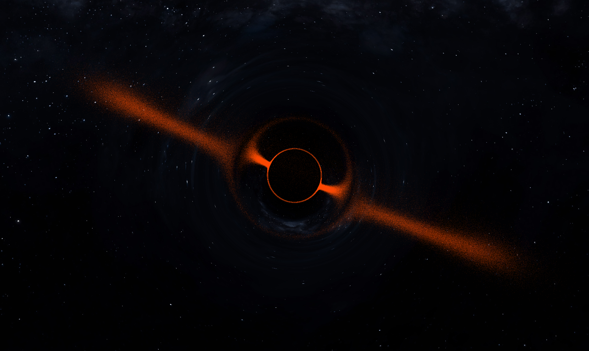

# orbs -- Optical Real-time Black hole Simulation

## Introduction
orbs is a real-time hardware-accelerated simulation of the light deflection
effects in the vicinity of a black hole.
These effects are made visible through a ring-like particle cluster around the
origin and a spherical background texture, while the user is free to shift
perspective by holding the left mouse button and moving as well as using the
mouse wheel.

## Building
The only supported platform for orbs is linux.
orbs is build using `make` with the dependencies `X11`, `OpenGL`, `glew`,
`libjpeg` and `libpng`.
